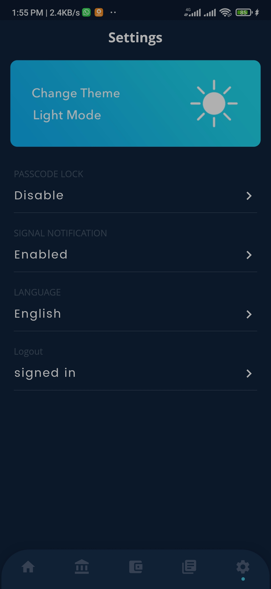

# mfp_dex_flutter

A decentralised cryptocurrency exchange app built with flutter. currently fetches all coin prices using coingecko api. Currently connect to metmask and custo rpc is not supported.

## Getting Started

This project can be compiled into android and ios app. webapp is also supported for this current version.

A few resources to get you started if this is your first Flutter project:

- [Lab: Write your first Flutter app](https://docs.flutter.dev/get-started/codelab)
- [Cookbook: Useful Flutter samples](https://docs.flutter.dev/cookbook)

For help getting started with Flutter development, view the
[online documentation](https://docs.flutter.dev/), which offers tutorials,
samples, guidance on mobile development, and a full API reference.

## illustrations

  

